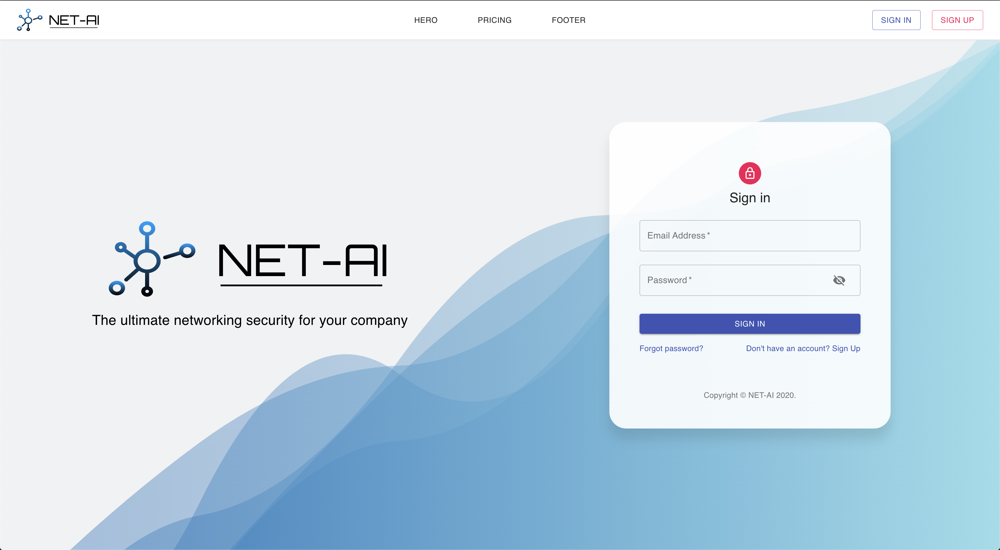

# Firebase Auth Starter

This is a SPA built with React + firebase authentication + firestore database starter for quickly coding up projects with similar structure.

Features: lazy loading, protected routing, client-side and server-side form verification.

Check it out live [here](https://firebase-auth-starter.netlify.app/).

